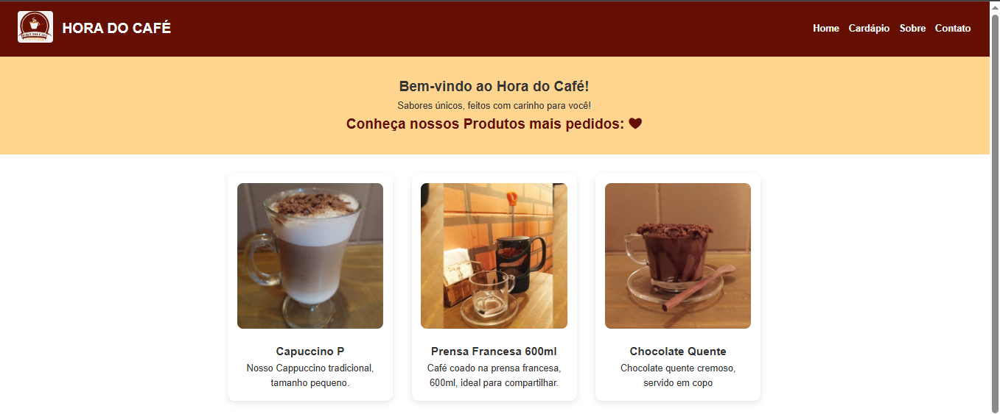

# Menu Online


## Visão Geral

O **Menu Online** é um projeto simples desenvolvido para facilitar a visualização de cardápios digitais do [Hora do café](https://www.instagram.com/hora_do.cafe/) . Ele permite que a cafeteria apresente seus produto de forma interativa e acessível, proporcionando uma melhor experiência para os clientes aqui da cidade.

## Funcionalidades

- Visualização do cardápio digital
- Organização dos itens por categorias
- Interface amigável e responsiva
- Facilidade de atualização dos itens do menu

## Tecnologias Utilizadas

| Tecnologia | Descrição                              |
|------------|----------------------------------------|
| HTML       | Estruturação das páginas               |
| CSS        | Estilização da interface               |
| JavaScript | Lógica de interação e manipulação dos dados |

## Estrutura do Projeto
```plaintext
menu-online/
├── 📁 assets/
|   └── 🖼️ images -> (imgs da estrutura)
|   └── 📜 data.json
│   └── 📁 img/
│       └── 🖼️ (imagens utilizadas no projeto, como logos e screenshots)
├── 📁 css/
│   ├── 🎨 style_global.css
│   ├── 🎨 contact.css
│   └── 🎨 about.css
|   └── 🎨 menu.css
├── 📁 js/
│   ├── 📜 menu.js
│   ├── 📜 script.js
│   └── 📜 contact.js
├── 📁 pages/
│   ├── 📝 about.html
│   ├── 📝 contact.html
│   ├── 📝 menu.html
├── 🏠 index.html
├── 📄 README.md
└── 📄 LICENSE
```

- **Front-end:** Desenvolvido apenas com HTML, CSS e JavaScript puro, sem uso de frameworks.
- **Dados Locais:** Todas as informações do cardápio são armazenadas localmente em arquivos JavaScript ou JSON, sem integração com banco de dados externo. Isso facilita a manutenção e atualização dos itens do menu diretamente no código.
- **Responsividade:** O layout foi pensado para funcionar bem em diferentes dispositivos, garantindo uma boa experiência tanto em desktops quanto em dispositivos móveis.

## Objetivo:

- 📌**Criar um projeto Front-end** a fim de validar habilidades desenvolvidas durante a matéria de **Desenvolvimento Front-end** da [Unicesumar](https://www.instagram.com/esoft_unicesumar_ead/?hl=pt-br) do curso de Engenharia de software,  fui além e busquei produzir algo real para um comercio de café local visando contribuir e fazer uso da tecnologia para mudar realidades, dessa iniciativa surgiu o cardápio online da cafeteria [Hora do café](https://www.instagram.com/hora_do.cafe/).

## Licença

Este projeto está licenciado sob a [MIT License](LICENSE).

## Desenvolvido:

Developer for porject: [José Gonçalves](https://www.linkedin.com/in/jgoncalvessf/)💻